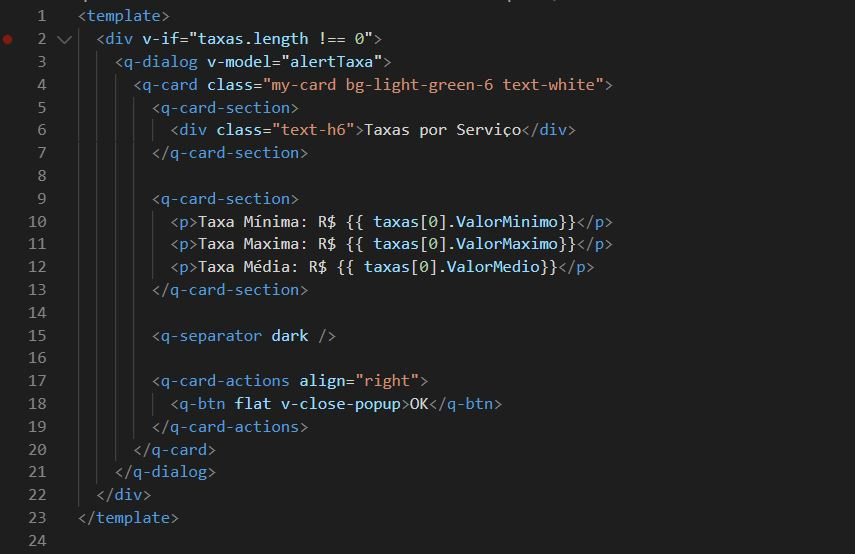
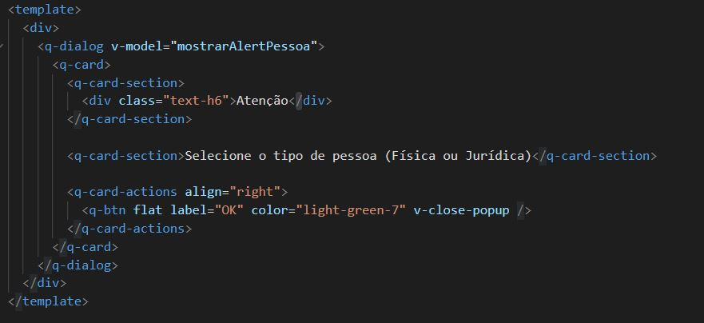

# Guia de agências e serviços bancários

Uma simples aplicação com o framework Quasar e a API do Bacen.

## Translation
- [English version](TRANSLATION.md)

## Tecnologias
- [Quasar Framework](https://quasar.dev)
- [API do Bacen](https://dadosabertos.bcb.gov.br/dataset?res_format=API)
- [Axios](https://github.com/axios/axios)
- [Vuex](https://vuex.vuejs.org/)

## Sobre a API do Bacen
Esta API disponibiliza informações sobre os bancos brasileiros e dados sobre a economia do país.

## Instalando o que você precisará

### Instalando as dependências

Se você baixar este projeto e quer executá-lo localmento, você precisará deste comando:

```bash
npm install
```

### Iniciando um novo projeto

Mas se você desejar começar um novo projeto, você deve executar o seguinte comando:

```bash
quasar create project-name
```

Atenção: para executar o comando acima você precisa ter instalado a ferramenta quasar/cli. Você pode ler sobre isso na [documentação do framework](https://quasar.dev/quasar-cli/installation)

Quando você executa o comando "quasar create nome-projeto", o quasar/cli irá perguntar para você algumas coisas. Você deve prestar atenção na seguinte pergunta:

```bash
Check the features needed to your project:
```

Então para este projeto você deve marcar para instalar ESLint, Axios e Vuex.

### Iniciar a aplicação no modo de desenvolvimento
```bash
quasar dev
```

### Build para produção
```bash
quasar build
```

## Explicando o projeto

Este projeto é dividido em seis componentes e duas páginas.

#### Index page

Esta imagem mostra quais componentes são usados na página de index.


A próxima imagem apresenta as variáveis usadas no componente "q-select", e o método executado para mudar o valor do state model (variável que guarda o tipo de pessoa: 'Física' e 'Jurídica')


### Componentes usados na página index

### Tabela de tipo de serviço

Nesta imagem mostra a atribuição de "dados" para a propriedade "data" que preencherá o conteúdo da tabela, e a atribuição da variável local colunas para a propriedade columns que irá definir as colunas da tabela.


Um bom ponto para ressaltar nesse pedaço de código, é que o método "mostrarServico()" faz uma requisição para a API e rececbe um parâmetro no qual serve como um filtro. O parâmetro passado para o método é o nome do serviço sem a primeira letra, isto é feito por que a API tem um filtro que procura dados que contém um certo pedaço de palavra. Então se voc~e colocar como filtro a palavra "inanceiro" the API certamente irá retornar para você os dados que contem "Financeiro" ou "financeiro", mas se você usar como filtro a palavra "financeiro" a API retornará para você dados contendo exatamente a palavra "financeiro", as outras palavras com a primeira letra em maiúscula serão ignoradas.

#### Tabela de serviço

Esta imagem mostra o template da tabela de serviço. A strutura principal é um componente de dialog que depende da vaiável local chamada "mostrarPaginaServicos" para aparecer. O método "mostrarTaxa" é uma action e é responsável pelas requisições das taxas de serviço.


The variable "servicos" is a vuex state and it is setted by the method "mostrarServico()" called on Type of Service Table (tabelaTipoServico.vue) component.

A variável "servicos" é um state do vuex e ela é configurada pelo método "mostrarServico()" chamado no componente tabela de tipos de serviço (tabelaTipoServico.vue)

Para exemplificar o que estou dizendo, veja esta imagem:


O state "paginaServico" é como se fosse um sinalizado que controla quando o componente "q-dialog" deve ser mostrado, mas se usá-lo diretamente na propriedade "v-model" do componente "q-dialog" deve ser declarado um método setter para essa variável. Você pode ler sobre isso [aqui](https://br.vuejs.org/v2/guide/computed.html#Atribuicao-em-Dados-Computados).

Porém podemos fazer a mesma funcionalidade usando a camada Watch do Vue, desta forma:


Este pedaço de código mostra que toda vez que o state "paginaServico" muda, a variável "mostrarPaginaServico" recebe o mesmo valor, e queando "mostrarServico" muda a mesma lógica se repete no sentido contrário.

### Taxas de Serviço

Este componente dialog irá mostrar as taxas de cada serviço.




A variável "taxas" é um state do vuex.
O state "taxas" tem os valores mínimos, máximos e a média dos serviços
"alertTaxa" é uma variável local.

"alertTaxa" é configurado em:


Toda vez que "dTaxa" muda, a variável local "alertTaxa" receberá o mesmo valor que ela, e toda vez que "alertTaxa" muda este processo se repete no sentido contrário.

### Alerta Tipo de Pessoa

Este componente foi criado para aparecer sempre que um tipo serviço é escolhido sem um tipo de pessoa ser definido.



A mesma lógico aplicada nos outros componente de alertas é continuado neste.

## Página Banco
### Componente Árvore

Este componente é usado para mostrar todos os bancos e agências do estado.

Os dados são obtidos pelo método chamado no mounted().


E são salvos na variável local "bancos".


Esta variável local é passada para o componente "q-tree" para preencher o conteúdo do componente.

### Costumize as configurações do framework quasar

See [Configuring quasar.conf.js](https://quasar.dev/quasar-cli/quasar-conf-js).
